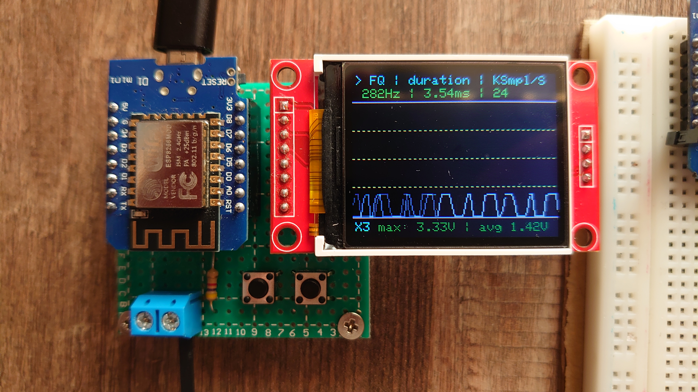
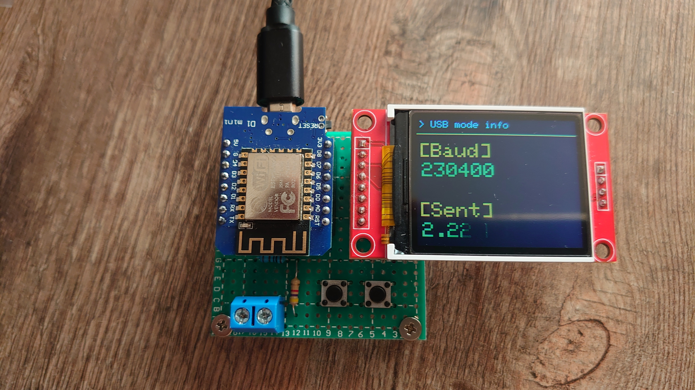

# Oscyllo

Self use oscilloscope project on [LOLIN(WEMOS) D1 R2 & mini](https://iotappstory.com/hardware/ESP8266/boards/lolinwemos-d1-r2-mini)

## Modes

- Direct reading - reads values from ADC and draw it on TFT 1.8.

- Save mode - in porcess...

- USB Mode - sends data via serial port. For reading use: **Oscyllo-tool**.

## Parameters

- CPU Freq - 80MHz
- ADC Sample speed - 24 KSample/sec
- Unwrap sample len - 256 probes

## License

[MIT](https://choosealicense.com/licenses/mit/)

